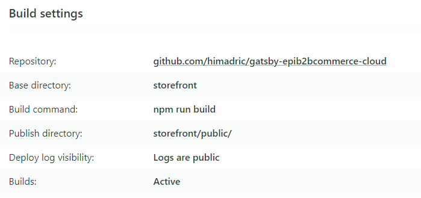

# Episerver B2B Commerce Cloud JAMStack implementation

## Introduction
[JAMStack](https://jamstack.org/), it is like walking backward towards the history of web development technology, except this is for good reason. In 90s web development, we were all excited when web servers started processing web requests programetically and rendered dynamic htmls. Server side programming although provided much flexibility is not as fast as static html. Now armed with much better client side technology and build & deployment tools, JAMStack architecture is able achieve incredibly fast website performance.

In this project I built an Episerve B2B Commerce Cloud Storefront using JAMStack archtecture. I built the website using GatsbyJs and deployed in [Surge](https://surge.sh/) and [Netlify](https://www.netlify.com/). This is a catalog only storefront works as the below animation shows. There are bunch of products renederd from Epi B2B Commerce Cloud on the home page. You can navigate to product detail page and see products by category by clicking on the category link on products on the home page.


## Implementation Approach
For the storefront to show the products from ecommerce system, we need to get data from ecommerce system and convert it Gatsby's GraphQL schema format. Epi B2B Commerce is a headless commerce platform and supports access to the platform via Restful APIs. Although it is possible to consume data in Gatsby using Rest APIs, it is much easier if data are presented in form GraphQL query. For this reason I have used [Epi B2B GraphQL Wrapper](https://github.com/himadric/graphql-wrapper-epib2bcommerce) that I have implemented ealier. This GraphQL APIs are hosted as a separate process (locally runs on http://localhost:4000 or in Heroku) and returns data from the ecommerce system.

For converting data to Gatsby Nodes, we need a Source Plugin like Gatsby Source Plugin for File System or Markdown Source Plugin. I have created a Source Plugin called source-plugin-insite. This plugin queries the wrapper and converts data to Gatsby Nodes. Two types of nodes are added through the plugin, Product nodes and Category nodes and they are related via child/parent relationship. I also created remote file node for product and category image which later used to optimize remote images using gatsby-image package.

On the storefront application source-plugin-insite has been referenced in gatsby-config.js. All products are displayed on the home page using page query. Product Detail and Products by Category pages were created using templates. These pages get created at the build time using Gatsby createPage API in gatsby-node.js.  

## Running Application Locally
### Running GraphQL Server Locally
* Clone [Epi B2B GraphQL Wrapper](https://github.com/himadric/graphql-wrapper-epib2bcommerce)
* Open command prompt
* Change directory to project folder
* Run the command 'npm install' to install all required packages
* Run the command 'npm run dev'. This will start GraphQL Server at http://localhost:4000
* Open the browser and go to http://localhost:4000. It should bring up GraphQL Playground.
### Running Storefront Locally
* Clone this repository
* Open VS Code and open the project folder
* Open a terminal in VS Code
* change directory to storefront folder
* Make sure gatsby-node.js in source-plugin-insite is pointing to GraphQL server http://localhost:4000
* run the command 'gatsby develop' or 'npm run develop'. This should start the web server at http://localhost:8000
* Open the browser and go to http://localhost:8000 to launch the application.
## Deploying to Surge
Easiest way to deploy a static site is to deploy it in [Surge](https://surge.sh/). Watch the below video to learn how to create an account in Surge and how to deploy the site.

[](https://www.youtube.com/watch?v=-EjdMvYPSVU)

* Build the storefront site using command 'npm run build'. This will create all the static files in public folder under storefront project.
* Login to Surge using command 'surge login' assuming that you have downloaded surge cli and created the account already.
* Change folder to 'public' folder.
* Run the command 'surge'. This will deploy the site and provide a random link. For me surge returned the link https://flagrant-bears.surge.sh/
## Deploying to Netlify
Deploying to Netlify takes little more work
* Create an account in Netlify
* You need to fork the repository or create your own repository and connect the repository to your Netlify account.
* I had some trouble deploying code initially to Netlify becuase there are two projects, source-plugin-insite and storefront (has a reference to plugin project). Build for source-plugin-insite was failing because script failed to install install node modules. After I made the below change in the script in package.json build started working. 
```
    "install-plugin": "cd ../source-plugin-insite && npm i",
    "build": "npm run install-plugin && gatsby build",
```
* On the Netlify side I used below build settings

* Once deployed successfully you will be provided a link for the website. For my build it was https://5fee330f42d898ff3a79e845--wonderful-panini-74271a.netlify.app/
